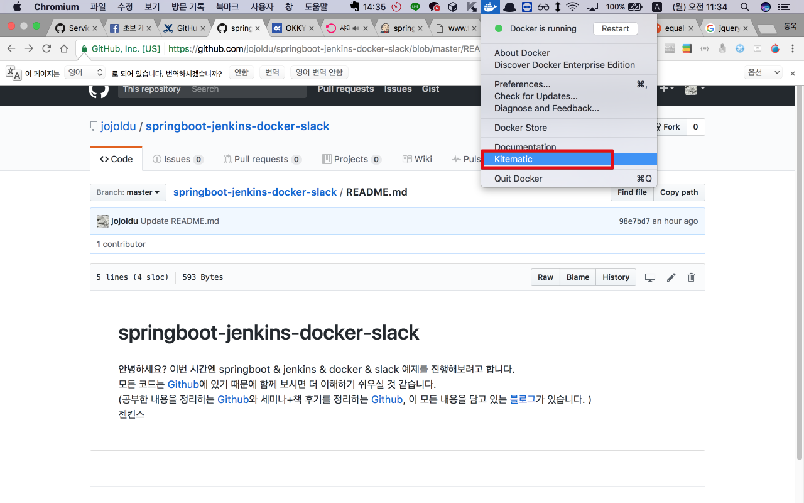
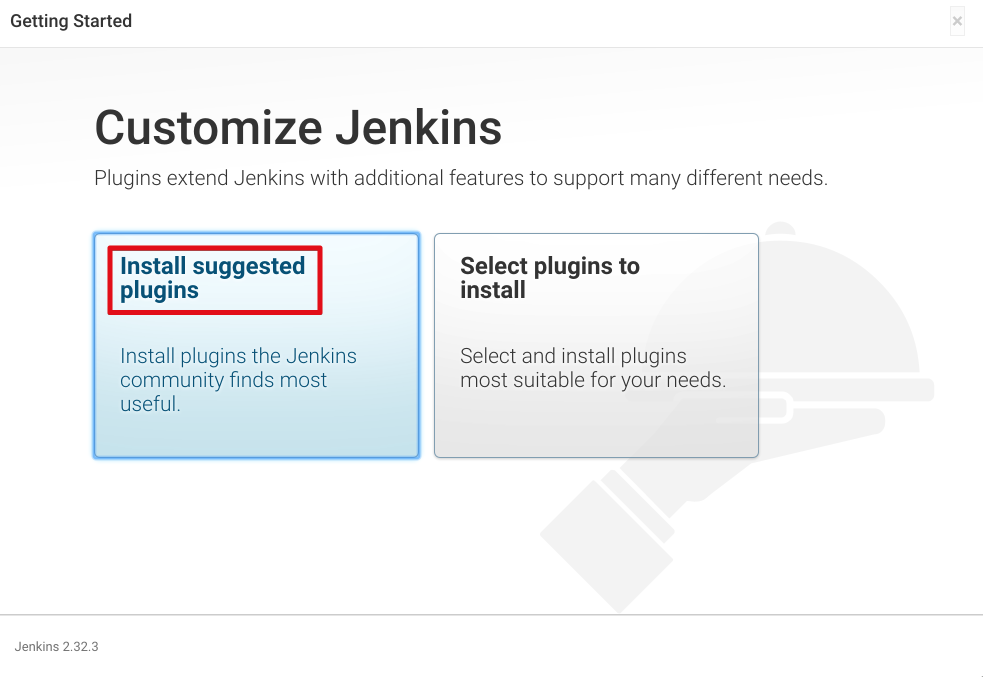
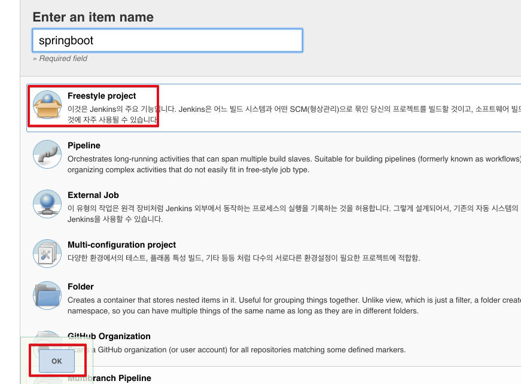
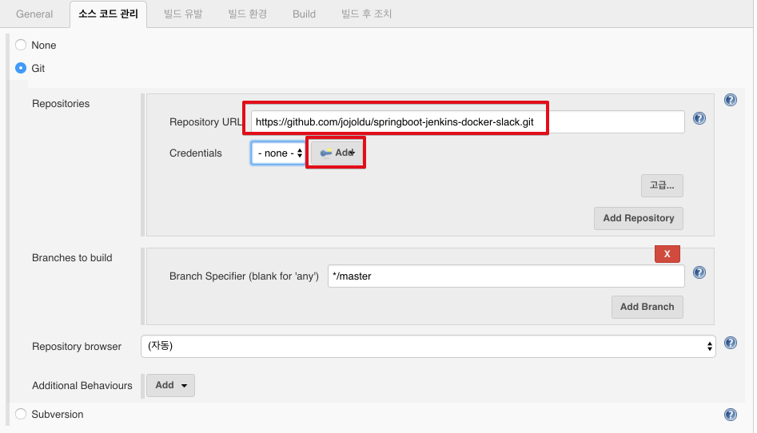
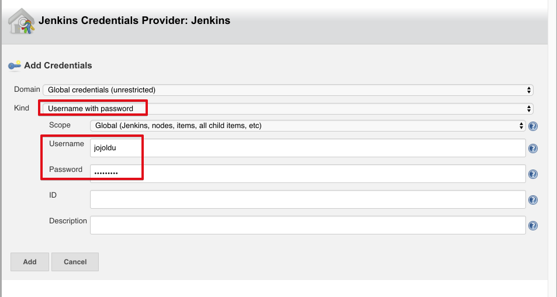
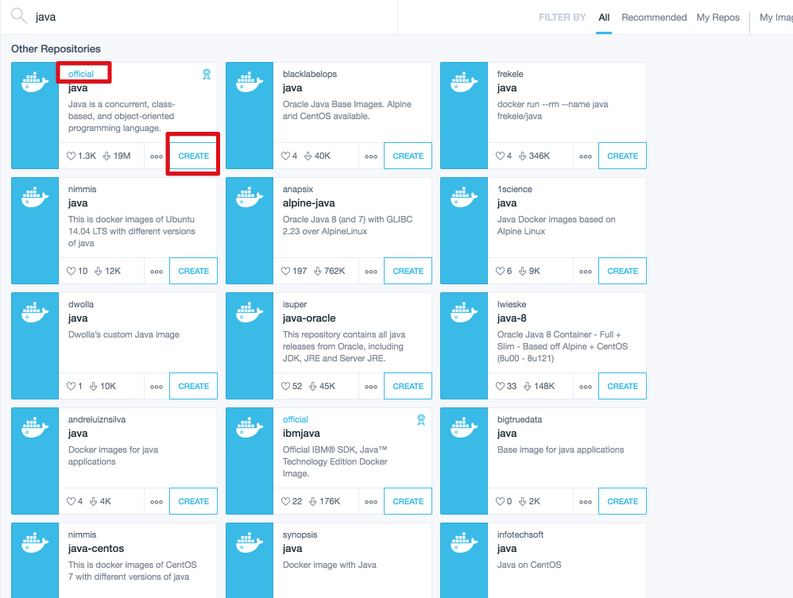

# 도커로 CI 구축 연습하기 (젠킨스, SpringBoot, slack)
안녕하세요? 이번 시간엔 도커로 CI 구축 연습하기 (젠킨스, SpringBoot, slack) 예제를 진행해보려고 합니다.  
모든 코드는 [Github](https://github.com/jojoldu/springboot-jenkins-docker-slack)에 있기 때문에 함께 보시면 더 이해하기 쉬우실 것 같습니다.  
(공부한 내용을 정리하는 [Github](https://github.com/jojoldu/blog-code)와 세미나+책 후기를 정리하는 [Github](https://github.com/jojoldu/review), 이 모든 내용을 담고 있는 [블로그](http://jojoldu.tistory.com/)가 있습니다. )<br/>

사내에서 젠킨스를 통해서 빌드/배포를 관리하고 있습니다.  
여태 CI를 경험해본적이 없어 연습겸 구축을 해봐야겠다고 생각을 하였습니다.  
개인 서버가 별도로 없어서 어디에 구축을 해야하나 고민하던 중, 도커가 생각나서 도커에 구축하여 같이 연습을 하게되었습니다.  
도커와 젠킨스 초보이다보니 잘못된 내용이 있을 수 있습니다. 발견하시면 언제든 댓글 혹은 풀리퀘스트 부탁드리겠습니다.  

## 젠킨스 & Github 연동
젠킨스는 도커 컨테이너를 이용해서 사용할 예정입니다.  
혹시나 도커에 대해서 모르시는 분들은 [링크](https://subicura.com/2017/01/19/docker-guide-for-beginners-1.html)를 참고하세요.  

### 젠킨스 도커 컨테이너 설치
위 링크를 통해 젠킨스를 설치하셨다면 도커의 Kitematic을 실행합니다.  


Kitematic에 로그인 하신뒤, 접속하시면 아래와 같이 검색창과 추천 컨테이너 리스트가 등장합니다.  
젠킨스를 선택해서 create 버튼을 클릭합니다.  


그럼 아래와 같이 설치가 진행됩니다.  


터미널을 열어 젠킨스 컨테이너가 잘 설치되었는지 확인하겠습니다.  

```
docker ps -a
```

(전체 컨테이너 리스트를 확인합니다.)


저는 기존에 설치된 젠킨스가 있어 2개의 젠킨스 컨테이너가 구동되고 있습니다.  
젠킨스 컨테이너의 8080포트가 localhost의 32769 포트로 연결되었음을 확인할 수 있습니다.  
브라우저를 열어 localhost:32769 로 접속하겠습니다.  
접속하시면 아래와 같이 젠킨스의 비밀번호를 입력하는 페이지가 출력됩니다.


화면에 출력된 경로에 가면 젠킨스 비밀번호가 있습니다. 직접 젠킨스 컨테이너에 접속하여 비밀번호를 찾아보겠습니다.  
터미널을 열어 아래처럼 입력하겠습니다.  


명령어 입력 후, 젠킨스 컨테이너에 bash로 접속된 것을 확인할 수 있습니다.  
경로를 따라 패스워드를 찾겠습니다.  


출력된 패스워드를 브라우저에 입력하시면 젠킨스 설치페이지로 이동하게 됩니다.  
여기서 **install suggested plugins** 를 선택하시면 많이 사용되는 플러그인들이 포함되어 자동 설치되니 **install suggested plugins**로 설치를 하겠습니다.  


설치가 끝나면 관리자 계정을 생성하시고 접속하겠습니다.  
(저는 새로 설치하게되서 포트가 다르지만 처음 설치하시는 분들은 32769포트로 접속하시면 됩니다.)  
  


접속화면이 잘 보이신다면 설치가 잘 된것입니다!  
수고하셨습니다!
젠킨스 설치가 끝났으니 이제 Github 연동을 진행해보겠습니다.  

### Github 연동
원래는 Github 플러그인을 별도로 설치해야하지만, 젠킨스 설치단계에서 **install suggested plugins**을 선택했기 때문에 이미 설치되어있어 이부분은 생략하겠습니다.  
(혹시나 젠킨스 컨테이너를 다시 시작해야 한다면 ```docker start jenkins```로 설치된 젠킨스 컨테이너를 실행 후, ```docker exec -it jenkins /bin/bash``` 를 입력하시면 됩니다.)  
(```docker run```은 재설치를 합니다.)  
  
젠킨스 페이지에서 ```새로운 Item```을 클릭합니다.  


아이템명(Job명)을 등록하고 ```Freestyle Project```을 선택하여 OK를 클릭합니다.  



그럼 해당 Item(Job)의 설정화면으로 이동하게 됩니다.  
여기서부터는 젠킨스로 관리할 Github 프로젝트가 있어야하기 때문에 Github 프로젝트를 하나 생성하겠습니다.  
생성된 Github 프로젝트 페이지에서 url을 복사합니다.  
  


좀전에 열어놓은 ```Item 설정화면```의 소스코드관리탭에서 ```Git``` 라디오 버튼을 선택하면 git url을 입력하는 곳이 나오는데 이곳에, 복사된 url을 입력합니다.  



이후 ```Add``` 버튼을 클릭하면 아래와 같은 화면이 나타나는데



kind를 ```username with password```로 선택하시고, 해당 github 프로젝트의 **github 계정과 비밀번호**를 입력하시면 됩니다.  
  
입려이 완료되면 ```Credentials``` 선택창에 방금 등록한 계정정보가 출력되니, 이를 선택합니다.  


branch의 경우 master push시에 젠킨스 빌드가 관리 되도록 master를 입력하였습니다.  만약 develop브랜치에 push시에 빌드되도록  하신다면 ```*/develop```를 입력하시면 됩니다.  
  
빌드 trigger는 Githu hook trigger를 선택하시면 됩니다.  


젠킨스 설정은 이제 끝이났습니다.  
Github 설정으로 가보겠습니다.  

* ngrok 설치
[ngrok](https://ngrok.com/)

## Java




## 참고
* [iamkyu.com](http://www.iamkyu.com/121)
* [젠킨스 위키](https://wiki.jenkins-ci.org/display/JENKINS/GitHub+plugin)